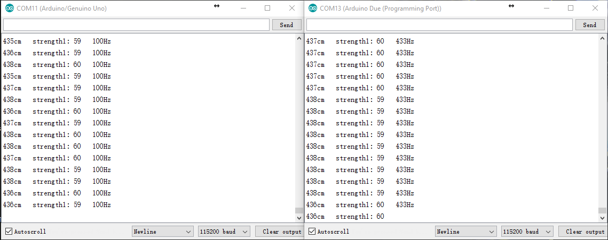

# TFmini_Arduino
**Note: also suitable for TFmini Plus**

TFmini Examples on Arduino. 中文版请点击 [README_CN.md](/README_CN.md).     

  - [TFmini_Arduino_HardwareSerial_Polling](#tfmini_arduino_hardware_serialpolling)
  - [TFmini_Arduino_HardwareSerial_Interrupt](#tfmini_arduino_hardwareserial_interrupt)
  - [TFmini_Arduino_SoftwareSerial](#tfmini_arduino_softwareserial)
  - [TFmini_Arduino_SoftwareSerial_Multiple](#tfmini_arduino_softwareserial_multiple)
  - [TFmini_Arduino_SoftwareSerial_Multiple_Frequency](#tfmini_arduino_softwareserial_multiple_frequency)
  - [TFmini_Arduino_I2C_1Master1Slave](#tfmini_arduino_i2c_1master1slave)


---    

## TFmini_Arduino_HardwareSerial_Polling  

Some Arduino boards, Arduino Uno for example, only has one serial port, but we can still read data from TFmini while do not disturb the data transmission from Arduino's TX to PC. It only need to connect TFmini's TX to Arduino's RX. Following is the connection method:

  


TFmini | Arduino 
---------|----------
 5V(RED) | 5V 
 GND(BLACK) | GND 
 TX(GREEN) | 0(RX)

Using a polling loop to read data, the code is as follow: 

```Arduino
void getTFminiData(int* distance, int* strength) {
  static char i = 0;
  char j = 0;
  int checksum = 0; 
  static int rx[9];
  if(Serial.available()) {  
    rx[i] = Serial.read();
    if(rx[0] != 0x59) {
      i = 0;
    } else if(i == 1 && rx[1] != 0x59) {
      i = 0;
    } else if(i == 8) {
      for(j = 0; j < 8; j++) {
        checksum += rx[j];
      }
      if(rx[8] == (checksum % 256)) {
        *distance = rx[2] + rx[3] * 256;
        *strength = rx[4] + rx[5] * 256;
      }
      i = 0;
    } else {
      i++;
    } 
  }  
}

void setup() {
  Serial.begin(115200);
}

void loop() {
  int distance = 0;
  int strength = 0;

  getTFminiData(&distance, &strength);
  while(!distance) {
    getTFminiData(&distance, &strength);
    if(distance) {
      Serial.print(distance);
      Serial.print("cm\t");
      Serial.print("strength: ");
      Serial.println(strength);
    }
  }
}
```  

**Note that the TFmini's TX should be unplugged when downloading the program, and is plugged in Arduino's 0(RX) after it is done.**


## TFmini_Arduino_HardwareSerial_Interrupt  

The connection method is similar to that above, but receiving data in serial port event and printing in the loop() after received:

```Arduino
int distance = 0;
int strength = 0;
boolean receiveComplete = false;

void getTFminiData(int* distance, int* strength, boolean* complete) {
  static char i = 0;
  char j = 0;
  int checksum = 0; 
  static int rx[9];
  if(Serial.available()) {  
    rx[i] = Serial.read();
    if(rx[0] != 0x59) {
      i = 0;
    } else if(i == 1 && rx[1] != 0x59) {
      i = 0;
    } else if(i == 8) {
      for(j = 0; j < 8; j++) {
        checksum += rx[j];
      }
      if(rx[8] == (checksum % 256)) {
        *distance = rx[2] + rx[3] * 256;
        *strength = rx[4] + rx[5] * 256;
        *complete = true;
      }
      i = 0;
    } else {
      i++;
    } 
  }  
}

void setup() {
  Serial.begin(115200);
}

void loop() {
  if(receiveComplete) {
    receiveComplete = false;
    Serial.print(distance);
    Serial.print("cm\t");
    Serial.print("strength: ");
    Serial.println(strength);
  }
}

void serialEvent() {
  getTFminiData(&distance, &strength, &receiveComplete);
}
```

**Note that the TFmini's TX should be unplugged when downloading the program, and is plugged in Arduino's 0(RX) after it is done.**  


## TFmini_Arduino_SoftwareSerial  
 
Using the SoftwareSerial library to simulate a serial port. The connection method is as follow:


Code reference [TFmini_Arduino_SoftwareSerial](/TFmini_Arduino_SoftwareSerial). 

Download the program and run.  


## TFmini_Arduino_SoftwareSerial_Multiple  

Listening to simulative serial port via polling loop to connect to multiple TFmini, it only need to connect to TFmini's TX and let RX dangle. In theory, almost every unoccupied digit IO can be used to connect to a TFmini.

  

Code reference [TFmini_Arduino_SoftwareSerial_Multiple](/TFmini_Arduino_SoftwareSerial_Multiple). 


## TFmini_Arduino_SoftwareSerial_Multiple_Frequency

Listening to simulative serial port via polling loop to connect to multiple TFmini, it only need to connect to TFmini's TX and let RX dangle. In theory, almost every unoccupied digit IO can be used to connect to a TFmini. This optimize the code above, encapsulate and add test frequence:

```Arduino
#include <SoftwareSerial.h>  

typedef struct {
  int distance;
  int strength;
  boolean receiveComplete;
}TFmini;

TFmini TFminiOne = {0, 0, false};
TFmini TFminiTwo = {0, 0, false};

//SoftwareSerial port(TX, RX);
SoftwareSerial portOne(2, 2);
SoftwareSerial portTwo(3, 3); 

void getTFminiData(SoftwareSerial* port, TFmini* tfmini) {
  port->listen();
  while(tfmini->receiveComplete == false) 
  {   
    static char i = 0;
    char j = 0;
    int checksum = 0; 
    static int rx[9];
    if(port->available()) {  
      rx[i] = port->read();
      if(rx[0] != 0x59) {
        i = 0;
      } else if(i == 1 && rx[1] != 0x59) {
        i = 0;
      } else if(i == 8) {
        for(j = 0; j < 8; j++) {
          checksum += rx[j];
        }
        if(rx[8] == (checksum % 256)) {
          tfmini->distance = rx[2] + rx[3] * 256;
          tfmini->strength = rx[4] + rx[5] * 256;
          tfmini->receiveComplete = true;
        }
        i = 0;
      } else {
        i++;
      } 
    } 
  } 
}

void setup() {
  Serial.begin(115200);
  portOne.begin(115200);
  portTwo.begin(115200);
}

void loop() {
    static unsigned long lastTime = millis();
    static unsigned int count = 0;
    static unsigned int frequency = 0;
    
    getTFminiData(&portOne, &TFminiOne);
    getTFminiData(&portTwo, &TFminiTwo);
    
    if(TFminiOne.receiveComplete == true && TFminiTwo.receiveComplete == true) {
      ++count;

      if(millis() - lastTime > 999) {
        lastTime = millis();
        frequency = count;
        count = 0;
      }   
    
      Serial.print(TFminiOne.distance);
      Serial.print("cm\t");
      Serial.print("strength1: ");
      Serial.print(TFminiOne.strength);
      Serial.print("\t");
    
      Serial.print(TFminiTwo.distance);
      Serial.print("cm\t");
      Serial.print("strength2: ");
      Serial.print(TFminiTwo.strength);
      Serial.print("\t");

      Serial.print(frequency);  //40~70Hz, It maybe higher if we don't print other thing. 
      Serial.println("Hz");
      
      TFminiOne.receiveComplete = false;
      TFminiTwo.receiveComplete = false;
    }

 }

``` 

Result:   


## TFmini_Arduino_I2C_1Master1Slave  

Slave unit Arduino Uno's RX is connected to a TFmini. It read the data from TFmini, send the data to PC via TX and also output via I2C(SCL and SDA pins). Master unit Arduino receive the data from slave unit via I2C(SCL SDA pins), and then send the data to PC via serial port. The connection method is as follow:

  

Code reference [TFmini_Arduino_I2C_1Master1Slave](/TFmini_Arduino_I2C_1Master1Slave), Slave program is for Arduino Uno, **Note that the TFmini's green cable should be unplugged when downloading the program, and is plugged in Uno's RX after it is done.**. Master program is for Arduino Due. 

The received data is as follow:  

  

The left is TFmini's data in 100Hz, and the right is the data that Due received via I2C. We can observe that Due have read some repeated data, so the code should be modified to use millis() or software timer to set the frequence of reading to 100Hz. We can also know that, without other code changes, we should connect no more than 4 TFmini via I2C to ensure no data loss.  Using more than 4 TFmini could cause the decrease of frequence.
